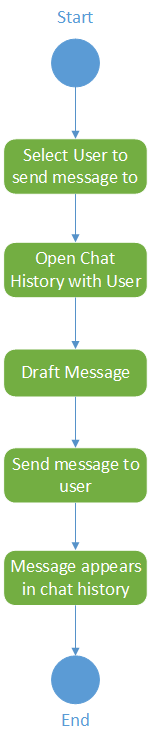
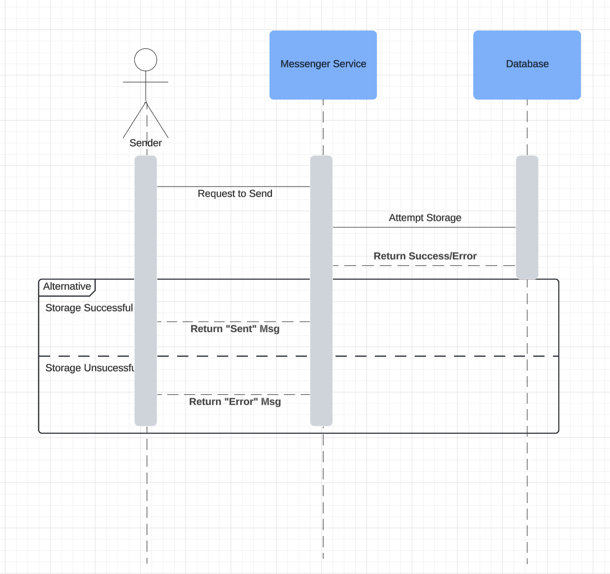
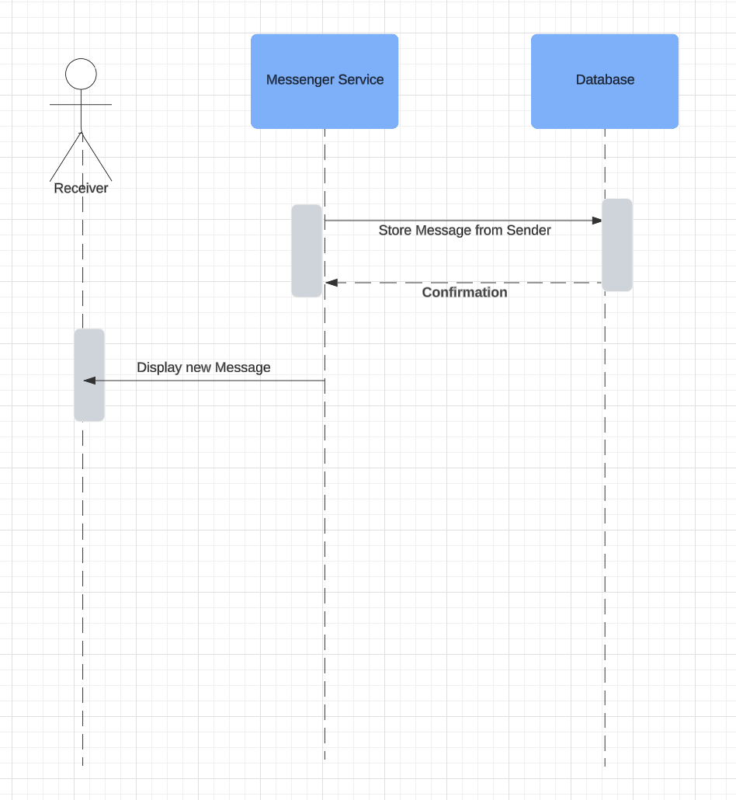
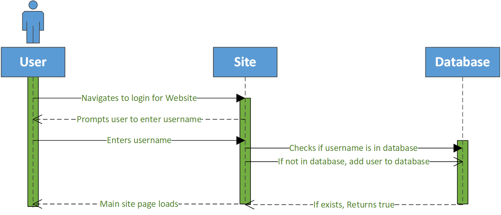
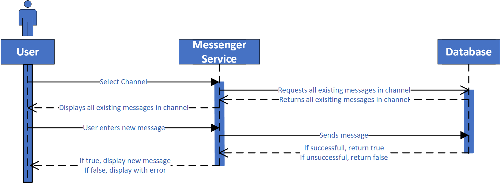

<h1>This is Sprint 0</h1>

    <h2>Activity Diagrams</h2>
    <h4>Login Activity Diagram</h4>
    
     
    <h4>Send Message Activity Diagram</h4>
    
     
    <h4>Receive Message Activity Diagram</h4>
    
    <h4>Send Message to Single Receiver Activity Diagram</h4>
    
    <h2>Sequence Diagrams</h2>
    <h4>Send Message to Single Receiver Sequence Diagram</h4>
    
    <h4>Receive Message Sequence Diagram</h4>
    	
    <h4>Login Sequence Diagram</h4>
    	
    <h4>Send Message Sequence Diagram</h4>
    	
    

## Use Case Descriptions

### Use Case: User Login

#### Actor: User

#### Description: 
This use case describes the process of a user logging into the messenger application.

#### Preconditions:

-   The user is not currently logged in.

-   The login page is accessible.

-   The user has network connectivity

#### Main Flow:

1.  The user navigates to the login page.

2.  The system displays a username field for the login form.

3.  The user enters a username in the username field.

4.  The user clicks the "Login" button.

5.  The system validates the username.

6.  The system logs the user in.

7.  The system retrieves the user's message information.

7.  The system redirects the user to their message dashboard.

#### Alternative Flows:

4a. The inputted username is not registered in the system.

1.  The system creates a new database entry for the inputted username.

2.  The use case resumes at step 6.

#### Postconditions:

-   The user is successfully logged into the system.

-   The user's session is created and maintained by the system.

-   The user's inputted username, if newly created, is logged by the
    system along with any following messages.

---

### Use Case: Receive Message

#### Actor: Registered User

#### Description:
This use case describes the process of a user receiving and viewing a message in the messenger application.

#### Preconditions:

-   The user is currently logged in.

-   The messaging feature is available.

-   The user is currently in a text channel or direct message.

-   Another registered user sent a message to the actor user. 

#### Main Flow:

1.  The system pulls the updated version of the current text channel or direct message.

2.  The system compares the user's current chat session and the pulled session for any new messages.

3.  The system displays any new messages in the user's message stream with a bold format.

4.  After 5 seconds, the bold format is cleared on the user's message stream.

#### Postconditions:

-   The received message is saved in the current text channel or direct message stream.

---

### Use Case: Send Message to Single Receiver

#### Actor: Registered User

#### Description: 
This use case describes the process of a user sending a message directly to a single recipient in the messenger application.

#### Preconditions:

-   The user is logged in.

-   The user's dashboard contains accessible direct message recipients

-   The user has network connectivity

-   The messaging feature is available

-   The message recipient is a registered user.

#### Main Flow:

1.  The user selects a user to direct message from their main dashboard.

2.  The system displays a stream view of message history in the selected
    text channel, along with an input field at the bottom of the screen.

3.  The user clicks on the message input field.

4.  The user composes a message and clicks on the "Send" button.

5.  The system validates the message.

6.  The system clears the input field.

7.  The system pushes the user's message to the database.

8.  The system displays the sent message in the current message stream.

#### Alternative Flows:

1a. The user does not have any previously saved direct messages.

1. The user clicks on the "Plus" button in the top right corner of the screen.

2. The system directs the user to a "New Message" screen with an input field for a recipient at the top, and an input field for the message at the bottom.

3. The user enters their desired recipient's username in the recipient input field.

4. The use case continues from step 3.

4a. The user sends too many messages in a short span of time.

1.  The user composes a message and clicks on the "Send" button.

2.  The system detects possible spam messaging.

3.  The system displays a message to the user reading "Slow down! You're
    sending messages too quickly."

4.  The system does not send the message to the text channel.

5.  The system clears the input field.

6.  If the user waits 10 seconds, go back to step 4 and continue as
    normal.

#### Postconditions:

-   The user's inputted message is successfully sent to the specified recipient.

-   The message is displayed in the message stream.

---

## Use Case: Send Message

#### Actor: Registered User

#### Description: 
This use case describes the process of a user sending a message to a text channel in the messenger application.

#### Preconditions:

-   The user is logged in.

-   The user's dashboard contains accessible text channels

-   The user has network connectivity

-   The messaging feature is available

#### Main Flow:

1.  The user selects a text channel from their main dashboard.

2.  The system displays a stream view of all messages in the selected text channel, along with an input field at the bottom of the screen.

3.  The user clicks on the input area.

4.  The user composes a message and clicks on the "Send" button.

5.  The system validates the message.

6.  The system clears the input area.

7.  The system pushes the sent message to the respective table in the message database.

#### Alternative Flows:

4a. The user sends too many messages in a short span of time.

1.  The user composes a message and clicks on the "Send" button.

2.  The system detects possible spam messaging.

3.  The system displays a message to the user reading "Slow down! You're sending messages too quickly."

4.  The system does not send the message to the text channel.

5.  The system clears the input area.

6.  If the user waits 10 seconds, go back to step 4 and continue as normal.

#### Postconditions:

-   The user's inputted message is successfully sent to the specified text channel.

-   The message is displayed in the channel's message stream.

---

## Trello Screenshots

#### Beginning:

#### Middle:

#### End:

