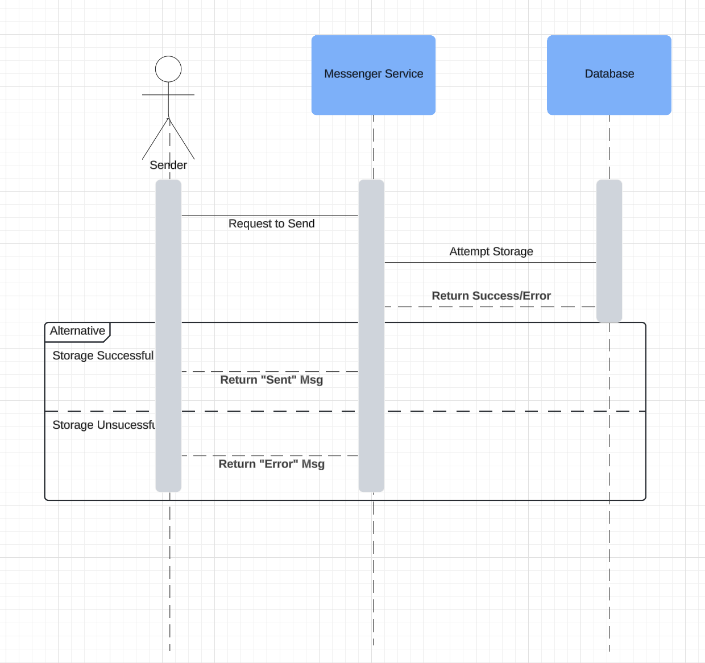
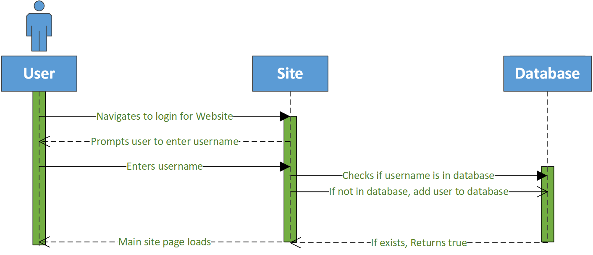

<h1>This is Sprint 1</h1>

    <h3>Activity Diagram</h3>
    <h4>Login Activity Diagram</h4>
    
     
    <h4>Send Message Activity Diagram</h4>
    
     
    <h4>Receive Message Activity Diagram</h4>
    
    <h4>Send Message to Single Receiver Activity Diagram</h4>
    
    <h3>Sequence Diagrams</h3>
    <h4>Send Message to Single Receiver Sequence Diagram</h4>
    
    <h4>Receive Message Sequence Diagram</h4>
    	
    <h4>Login Sequence Diagram</h4>
    	
    <h4>Send Message Sequence Diagram</h4>
    	
    

